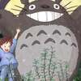

- 使用固定大小?

有可能需要更改图片大小?
使用 file totoro.jpeg 查看分辨率
使用  convert totoro.jpeg -resize 100x100 totoro1.jpeg 改变分辨率
# github_samples
describe my projects

### 文件结构
- .github中作为缓存图片
- 数据使用超链接进入;
- 各层的README.md, 相对链接

### .gitignore
- 编译环境的文件不进入git
- data,log等文件不进入git

### Installation and Dependencies
- Linux 版本, GPU版本, CUDA, cudnn版本
- Clone,pip3, some build

### run demo
- download pretrained models (saved in google drive)
  - 特殊路径
- dataset
- 

### 各文件路径
- 训练文件路径
- 预测文件路径

### 注意事项
- 各目录有自己的readme, 中文的README-CN.md
- 相对路径使用${projects}/ /path/to/...; 路径使用特殊标记
- 主目录下有changeslog.md
- 文件路径相对链接直接添加相对路径;
- related efforts

